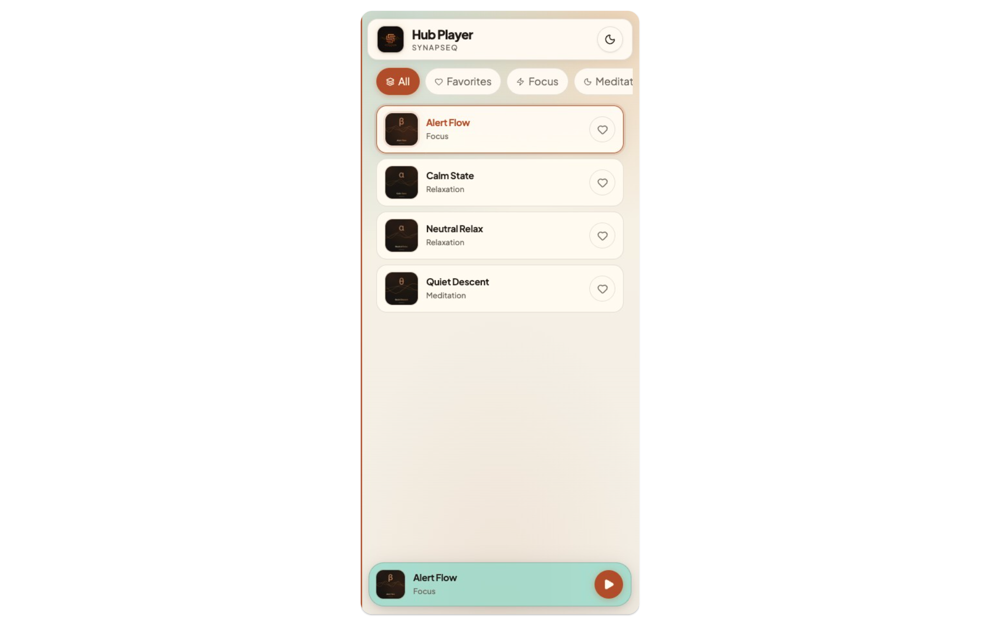
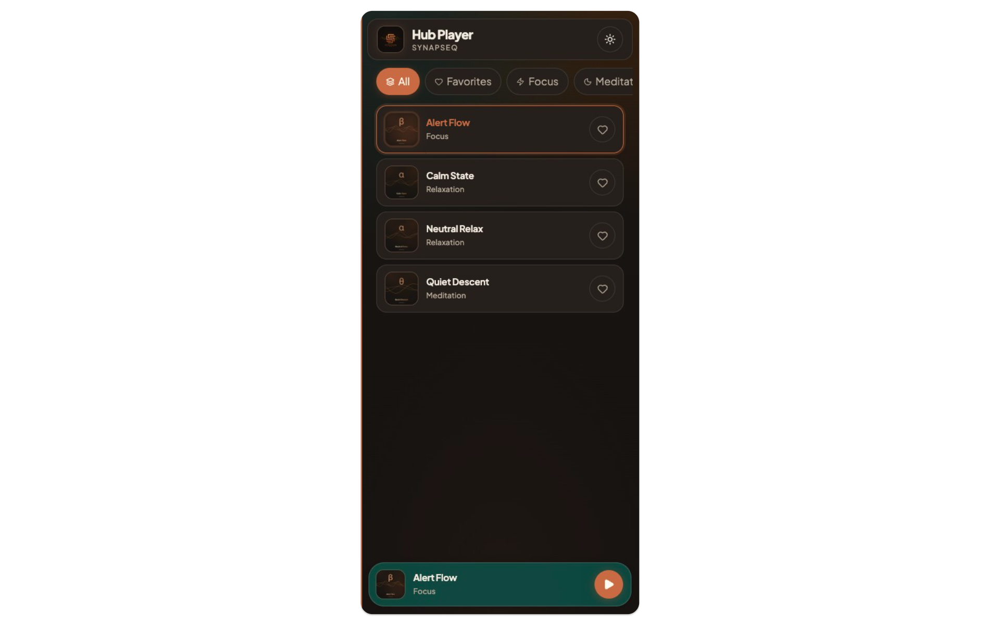
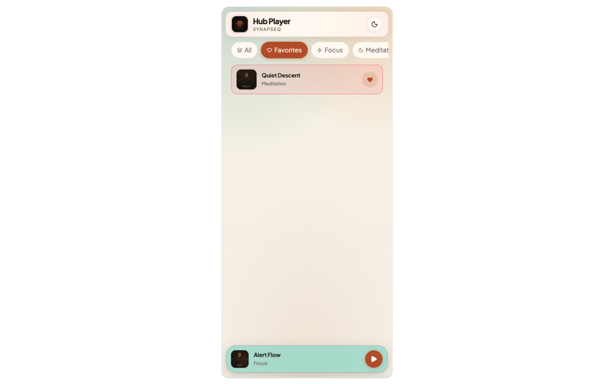
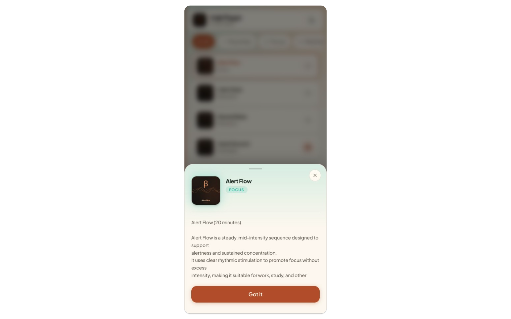

# SynapSeq Hub

**The official repository of sequences for [SynapSeq](https://synapseq.org).**

<table>
  <tr>
    <td></td>
    <td></td>
  </tr>
  <tr>
    <td></td>
    <td></td>
  </tr>
</table>

  

---

## Purpose

The goal of SynapSeq Hub is to provide an open, validated, and self-consistent collection of creative works built with SynapSeq.

It allows users to share, discover, and learn from each other's
compositions, ensuring both technical integrity and artistic freedom.

---

## Contributing

Please read the full [Contributing Guidelines](CONTRIBUTING.md)

---

### Reporting Copyright Concerns

The SynapSeq Hub is built on openly licensed contributions and community trust.

If you are an author and believe that one of your works has been published or reused in the Hub without permission or in violation of its license, please contact us immediately.

You can report the issue through:

- **GitHub Issues:** https://github.com/synapseq-foundation/synapseq/issues
- **GitHub Discussions:** https://github.com/synapseq-foundation/synapseq/discussions

Proper attribution and license compliance are core principles of the project, and any misuse will be addressed as quickly as possible.

## Compatibility

All sequences are compatible with **SynapSeq v4** and later.

---

## Learn More

- [SynapSeq Project](https://github.com/synapseq-foundation/synapseq)
